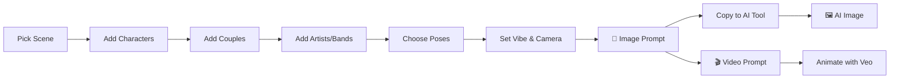

<div align="center">

# 🎵 The Man Who Can't Be Moved

### Prompt Generator Studio

**Generate high-quality AI image & video prompts for "The Man Who Can't Be Moved" crossover fan art.**

Configure characters, couples, artists/bands, scenes, poses, and vibes — then copy the prompt to Gemini, Midjourney, or Flux.

[](https://man-who-cant-be-moved-prompt-genera.vercel.app/)
[](https://nextjs.org/)
[](LICENSE)

</div>

---

## 🎬 What is This?

**"The Man Who Can't Be Moved"** is a viral AI image trend where iconic characters from anime, K-drama, and films are gathered together in a single scene — all sharing the same emotional experience of being left behind by someone they loved.

This tool helps you **build detailed, high-quality prompts** to generate these images using AI tools like Gemini, Midjourney, DALL-E, or Flux.

> Instead of writing prompts from scratch, just pick your scene, characters, poses, and vibe — and the tool generates a structured, production-quality prompt for you.

---

## ✨ Features

<table>
<tr>
<td width="50%">

### 🏙️ Scene Builder
- **21 scene presets** — Indomaret, angkringan, Seoul rooftop, anime worlds, and more
- **Custom scene** option for full creative control
- Configurable **weather**, **time of day**, **furniture**, **food & drinks**, and **background props**
- All fields are optional and clearable

</td>
<td width="50%">

### 🧑‍🤝‍🧑 Character System
- **30+ characters** from anime, K-drama, and films
- **YOU slot** — insert yourself with exact face match instructions
- Up to **8 character slots** per scene
- Per-character **pose** and **art style** selection

</td>
</tr>
<tr>
<td width="50%">

### 💔 Couple System
- **Between / Beside** positioning — sit between or next to ex-couples
- Up to **2 couple slots** with individual or advanced pose control
- **Global User Position** — when 2 couples are active, set your position globally (center, side, behind, etc.)

</td>
<td width="50%">

### 🎤 Artist / Group Band
- **130 artists** across 5 regions: 🇺🇸 Western, 🇮🇩 Indonesia, 🇰🇷 Korean, 🇯🇵 Japan, 🇵🇭 Filipino
- **Solo & Band** support — bands have display mode (full/vocalist/custom members)
- **Band user position** — sit beside vocalist, across table, edge of group
- Searchable dropdown grouped by region

</td>
</tr>
<tr>
<td width="50%">

### 🎬 Video Prompt Engine
- **Multi-scene** video prompts (up to 5 scenes, 7s each)
- **30 character actions**, 16 camera focus, 19 camera movements
- Scene-by-scene timeline with beat breakdown
- Transition presets between scenes

</td>
<td width="50%">

### ⚠️ Pose ↔ Position Compatibility
- Smart system that **warns when pose conflicts with position**
- Covers ALL sections: Character, Couple, Global Position, Band
- Incompatible options shown with ~~strikethrough~~ + warning
- Prompt builder **auto-adjusts** conflicting text for natural output

</td>
</tr>
</table>

### More Features

| Feature | Description |
|---|---|
| 📋 **One-Click Copy** | Copy the entire generated prompt with a single click |
| 📱 **Mobile Responsive** | Full mobile support with bottom sheet prompt preview |
| 👁 **View Counter** | Live visitor count powered by Upstash Redis |
| 🔄 **New Prompt Reset** | Reset all fields to defaults with confirmation |
| 🎨 **Stitch-inspired Design** | Soft sage-green aesthetic with glassmorphism cards |
| 📖 **Built-in Tutorial** | Step-by-step guide with video animation workflow |
| 🎭 **68 Poses** | Categorized: duduk, makan, rokok, HP, baca, ekspresi, berdiri |

---

## 🛠️ Tech Stack

| Technology | Purpose |
|---|---|
| [Next.js 16](https://nextjs.org/) | React framework (App Router + Turbopack) |
| [Tailwind CSS 4](https://tailwindcss.com/) | Utility-first styling |
| [shadcn/ui](https://ui.shadcn.com/) | Base UI components |
| [Upstash Redis](https://upstash.com/) | Serverless view counter |
| [Vercel](https://vercel.com/) | Deployment & hosting |

---

## 🚀 Getting Started

### Prerequisites

- Node.js 18+
- npm or pnpm

### Installation

```bash
# Clone the repo
git clone https://github.com/Gimm17/ManWhoCantBeMoved-PromptGenerator.git
cd ManWhoCantBeMoved-PromptGenerator

# Install dependencies
npm install

# Run development server
npm run dev
```

Open [http://localhost:3000](http://localhost:3000) in your browser.

### Environment Variables (Optional)

For the view counter feature, create a `.env.local` file:

```env
KV_REST_API_URL=your_upstash_redis_url
KV_REST_API_TOKEN=your_upstash_redis_token
```

> The app works perfectly fine without these — the view counter simply won't display.

---

## 📁 Project Structure

```
├── app/
│   ├── api/views/          # View counter API route
│   ├── layout.tsx          # Root layout + metadata
│   └── page.tsx            # Home page
├── components/
│   ├── builder/            # Scene, Character, Couple, Artist, Vibe, Camera, Video sections
│   ├── output/             # Prompt output + mobile bottom bar
│   └── ui/                 # Reusable UI (SearchableSelect, Select, etc.)
├── context/                # React context for builder state
├── data/                   # Characters, artists, couples, poses, food, scenes, styles, videoScenes
├── hooks/                  # Custom hooks (useViewCounter)
└── lib/                    # Reducer, types, buildPrompt, buildVideoPrompt, poseCompat
```

---

## 🎯 How It Works



1. **Select a scene preset** (or go full custom)
2. **Add characters** from anime/drama/film roster
3. **Add couples** — sit between or beside them
4. **Add artists/bands** — 130 artists from 5 regions
5. **Pick poses** for each character (68 options!)
6. **Set the mood** — vibe, camera angle, photo style
7. **Copy the image prompt** → paste into Gemini / Midjourney / Flux
8. **Generate video prompt** → animate with Gemini Veo 🎬

---

## 🤝 Contributing

Contributions are welcome! Feel free to:

- Add new **characters** in `data/characters.ts`
- Add new **artists/bands** in `data/artists.ts`
- Add new **couples** in `data/couples.ts`
- Add new **poses** in `data/poses.ts`
- Add new **scene presets** in `data/scenes.ts`
- Add new **food/drink options** in `data/food.ts`
- Add new **video scene presets** in `data/videoScenes.ts`

---

## 📄 License

This project is open source and available under the [MIT License](LICENSE).

---

<div align="center">

**Built with ❤️ by [Gimora Digital](https://gimora.my.id/)**

[](https://github.com/Gimm17)
[](https://gimora.my.id/)

</div>
